# AI-database-2026

AI에이전트 개발자 데이터베이스 리포지토리

## 1일차

### DB의 특징

- 데이터 무결성(고유값.변동없음)
- 데이터 안정성(영구적 보관)
- 데이터 동시성
- 표준SQL 지원
- 확장성

### PostgreSQL 개요 (C+S+v / 편집기)

데이터베이스. 데이터를 한군데에서 관리하는 목적의 시스템

줄여서 Postgre, Postgres 라고 통칭. **관계형** 데이터베이스.

`SQL` 을 통해서 데이터를 저장, 수정, 삭제, 조회 할 수 있는 시스템

- 기타 관계형 데이터베이스

  - Oracle
  - MySQL / MariaDB
  - SQL Server

  위 대부분 상용 소프트웨어, Postgre는 **오픈소스 시스템** . 라이선스 비용 X

### PostgreSQL 설치

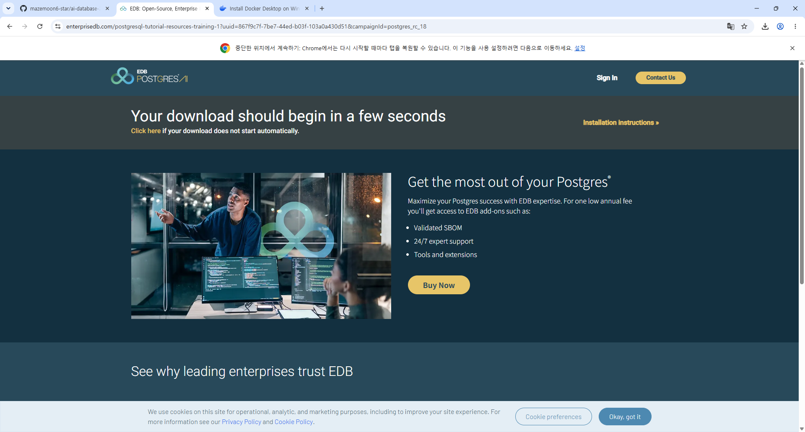

#### 기본 설치

- 자신의 OS에 직접 설치하는 방법

* postgresql-18.6-3-windows-x64.ex 실행

.png)

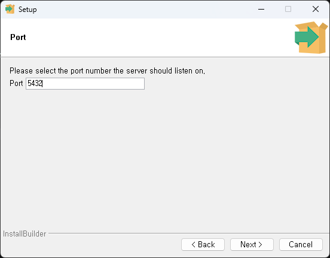

- superuser id  - postgre 패스워드 지정
- port 5432 기억할것 (port 는 내가 사용하면 다른 사람은 사용이 안됨)

### Docker 란,

- 환경의존성을 문제를 해결한 컨테이너 기술 솔루션
- __*가상환경*__ 상 프로그램을 실행하도록 제공
- 컨테이너란, OS, 라이브러리, 설정 등 하나의 패키지로 만들어진 이미지
- 기본 Docker(명령어) 실행파일 -> Docker Desktop(마우스로) 윈도우에서 Docker를 편하게 사용하도록

### Docker Desktop 설치

- 윈도우 버전으로 다운로드 후 설치
  (http://docs.docker.com/desktop/setup/install/windows-install/)
  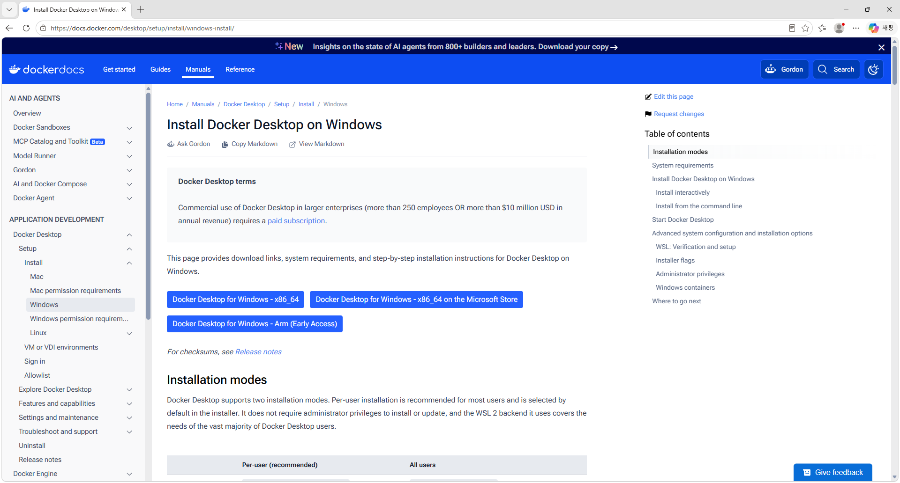

  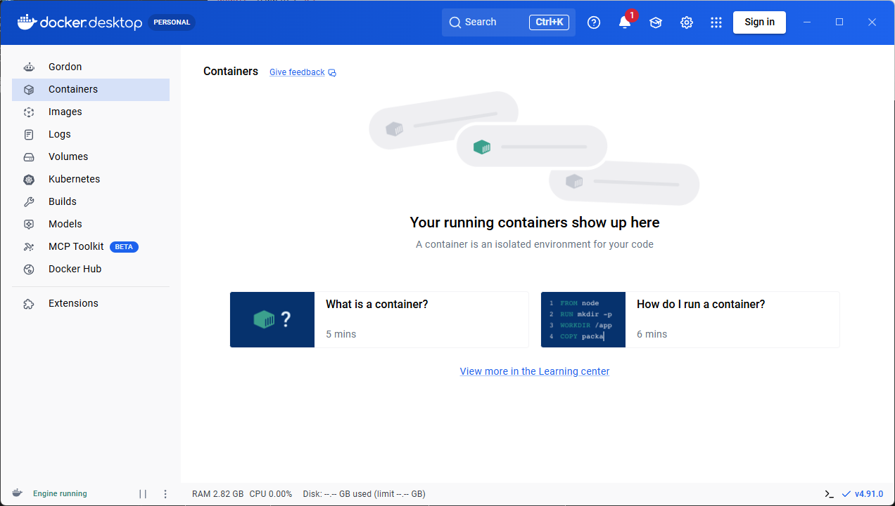
- Close and Restart 이후
- WSL(Windows Subsystem for Linux) 추가 설치

  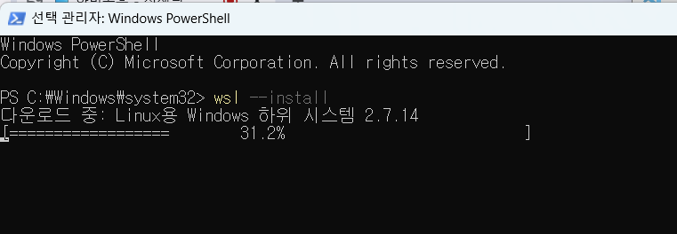

  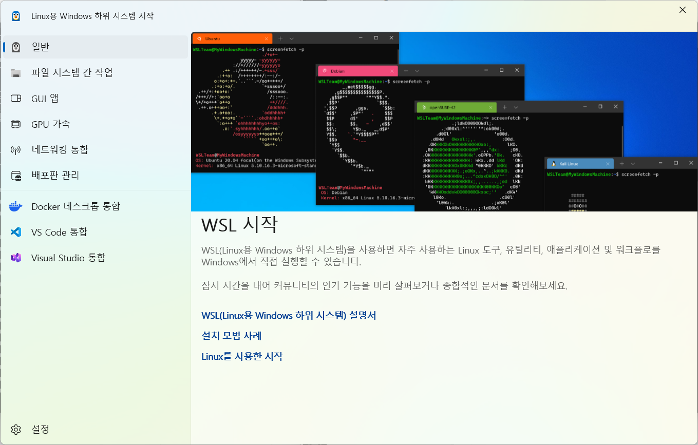

  - 설치 완료 후 화면
  - 사용자 user생성 비밀번호 입력

### DBeaver 설치

GUI DB관리 실행 툴

- https://dbeaver.io/download
  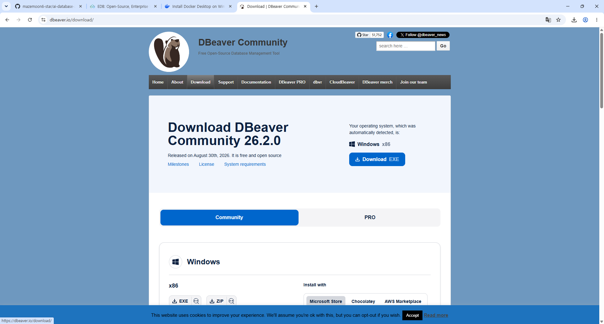
- 설치 후 DB접속

1. DBeaver 실행
2. 새 데이터베이스 연결 클릭
   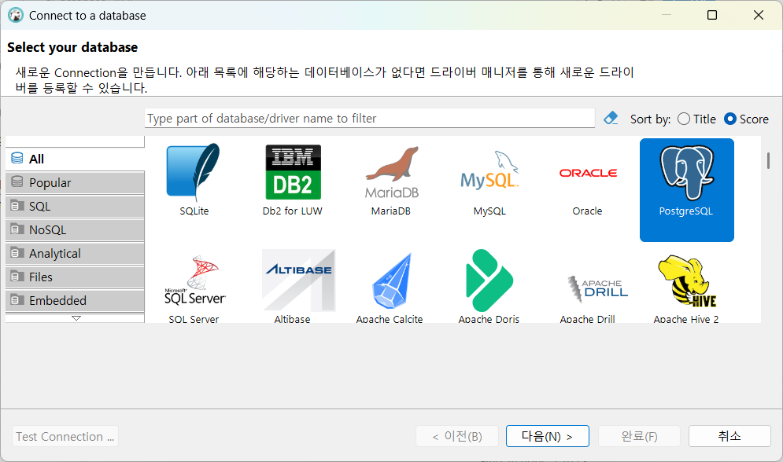
3. 데이터베이스 설정 입력(port확인 > show all databases 체크 > test connection 클릭)

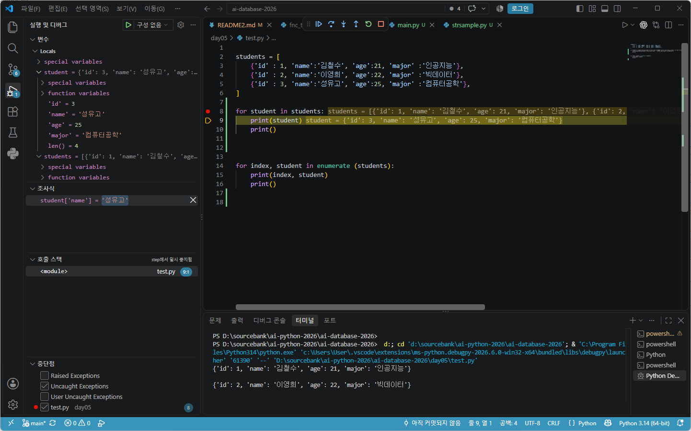

4. Test Connection 클릭 Driver 다운로드 후
5. Connected 나오면 정상접속 확인 후 완료 >> 마우스로 만든 거

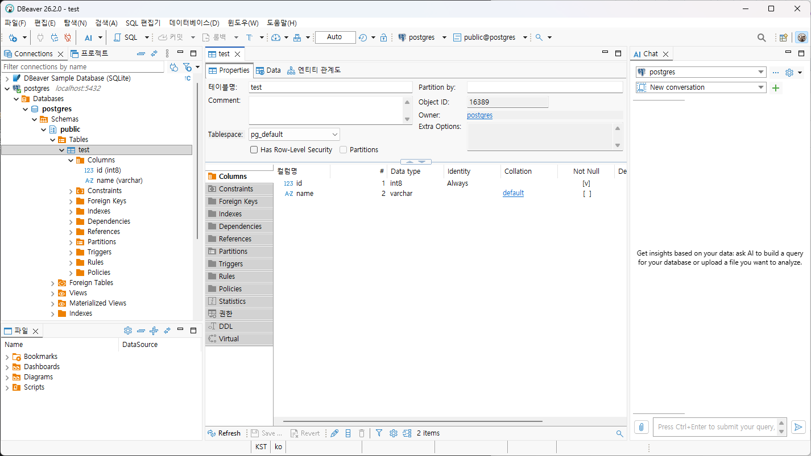
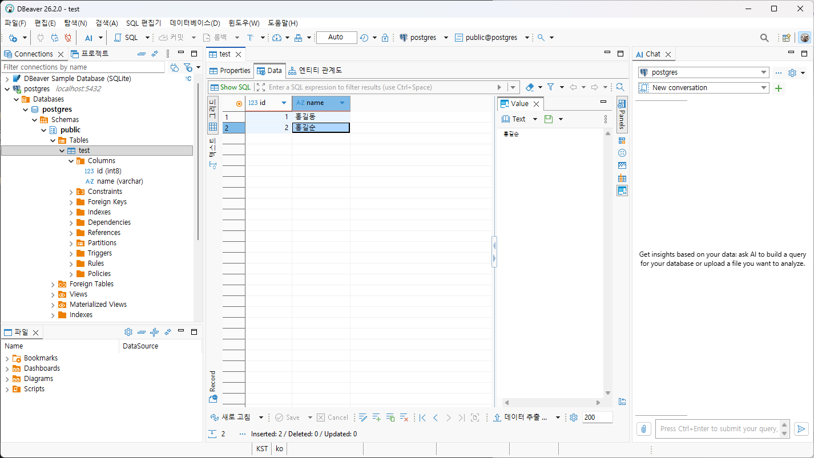

### PostgreSQL 이미지 다운로드

- 이미지 : 도커 리포지토리에 미리 만들어놓은 시스템 패키지
- 컨테이너 : 나의 도커에서 미리 다운로드 받은 이미지를 동작시킨 시스템

  ##### 도커 명령어 기본


  ```bash
  docker --version
  ```
- 설치된 도커 확인

  ##### 도커에서 PostgreSQL 이미지 다운로드


  ```bash
  docker pull postgres:latest
  ```
- Docker Desktop 전체 검색에서 pull(다운로드)

#### 컨테이너 실행

##### 도커 명령어로 실행

- 여러 옵션으로 실행 해야 하므로 거의 대부분 명령어로 실행
  ```bash
  docker run --name my-postgres -e POSTGRES_PASSWORD=123456 -p 25432:5432 -d postgres:latest
  ```

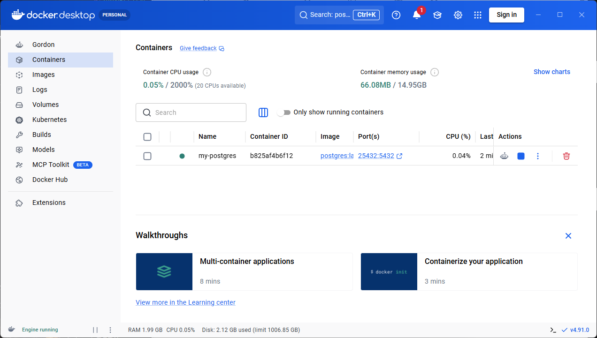

#### DBeaver에서 접속

### DB 기본 사용법

#### PostgreSQL 기본구조

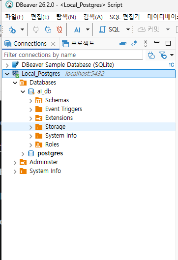

- ai_db : 데이터베이스(프로젝트 전체 공간)
- Schemas : 프로젝트 폴더
- Tables : 실제 데이터를 담는 표
- DB 만든 후 F5 새로고침으로 확인하기

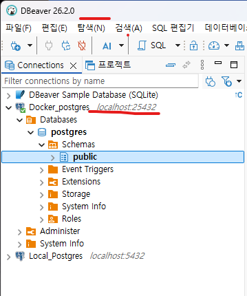

(docker 포터 25432 로 생성 후 DBeaver 에서 새로운 postgres DB생성)

#### DB생성

- DBeaver SQL편집기 클릭
- 새 이름으로 저장 , *(특정이름).sql 로 저장
- 아래의 코드를 작성

  ```sql
  create database ai_db;
  ```
- Ctrl + Enter 로 쿼리 실행
- DB 접속 정보에서 Show All Databases를 체크하고 재접속
- 데이터베이스 생성 확인

##### 테이블 생성

- 데이터베이스 스키마를 사용할 데이터베이스로 **반드시** 선택

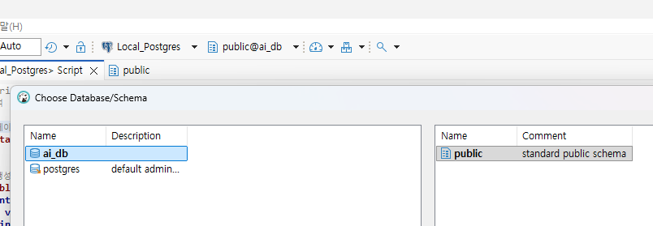

- 아래의 코드를 작성

  ```sql
  create table students (
       id int generated always as identity primary key, -- id 학생구분값 자동증가
       name varchar (50) not null, -- 이름
       age int,-- 나이
       email varchar(100), -- 이메일
       creatated_at timestamp default current_timestamp -- 현재 작성된 일자
  );
  ```

##### 데이터 생성

- insert(삽입)쿼리 / select(확인)쿼리> 난이도가 올라감 / update(수정)쿼리/ delete(삭제)쿼리  >>직접 입력해서 만든 거
- ```sql
  -- 데이터 삽입(INSERT)
  insert into public.students (name, age, email)
  values ('홍길동', 20, 'honggd@example.com');

  insert into public.students (name, age, email)
  values ('김철수', 21, 'chulsu@gmail.com'),
  ('이영희', 21, 'lee@gmail.com'),
  ('박민수', 22, 'park@gmail.com'),
  ('성명건', 50, 'sung@gmail.com');

  -- 데이터 확인(SELECT)
  select * from public.students;

  -- 데이터 수정(UPDATE)
  update students set
  email = 'hong@kakao.com'
  where id = 1;

  --데이터 삭제(DELETE)
  delete from students
  where name = '홍길동';
  ```

#### Postgres 기본 타입


| 데이터 타입 | 설명                     | 예제                |
| :---------- | ------------------------ | :------------------ |
| INT         | 정수                     | 10,25,-9            |
| BIGINT      | 큰 정수                  | 10000000            |
| NUMERIEC    | 정확한 소수              | 12000.56            |
| VARCHAR(n)  | 길이 제한 문자열(4000자) | '홍길동'            |
| TEXT        | 긴 문자열(1G)            | 뉴스 게시물 본문    |
| BOOLEAN     | 참 또는 거짓             | true, false         |
| DATE        | 날짜                     | 2026-09-15          |
| TIMESTAMP   | 일자(날짜와 시간)        | 2026-09-15 16:00:20 |
| JSONB       | JSON 데이터              | {"name" : "홍길동"} |

## 2일차

### SQL 기본

데이터베이스 내용에서 가장 기본적인 문법 CRUD

- SQL : Structured Query Language (구조화된 질의 언어)
- 쿼리로 통칭

#### CRUD 정의

데이터 처리의 기본 동작 네 가지


| 구분       | 의미               | 쿼리 명령어 |
| :--------- | ------------------ | ----------- |
| **C**REATE | 데이터 생성(삽입)  | `INSERT`    |
| **R**EAD   | 데이터 읽기(조회)  | `SELECT`    |
| **U**PDATE | 데이터 수정?(변경) | `UPDATE`    |
| **D**ELETE | 데이터 삭제        | `DELETE`    |

학생 관리 프로그램을 만든다고 가정하면,

- - 학생을 등록
  - 학생 목록 조회 / 특정 학생 내용 조회
  - 학생 정보 수정
  - 학생 정보 삭제

  ##### 데이터 생성
- 항상 SELECT  쿼리로 확인하기
- INSERT 쿼리로 데이터 추가

```sql
-- 학생 정보 추가 쿼리
-- 쿼리문법 문자열 무조건 ''
insert into students (name, age, email)
values ('홍길동', 20, 'hong@example.com');

-- 컬럼 순서 변경. 키와 값의 순서는 일치해야된다
insert into students (age, email, name )
values (29, 'minjoon@gmail.com' , '권민준');

--여러 데이터 추가
insert into students (name, age, email)
values ('홍길순', 20, 'hong1@example.com'),
('홍길자', 50, 'hong2@example.com'),
('홍길매', 30, 'hong3@example.com');


```

##### 데이터 조회

- SELECT 쿼리로 조회 - [소스](./assets/day%2002/practice02.sql)
- 처음에는 간단하지만, 뒤로 갈 수록 어려워짐
  ```sql
  -- 특정 컬럼만 조회
  select s."name" e, s.age from students s;


  -- 필터링! 필요한 데이터만 조회
  select * from students s 
   where s.age < 30;
  ```

#### 데이터 활용 조회

- 정렬

  - `ASC`ending : 오름차순
  - `DESC`ending : 내림차순
- 제한
- Limit : 필요 갯수만큼만 조회

###### 데이터 수정

- UPDATE 쿼리로 수정 - [소스]
- UPDATE 쿼리 실행시 WHERE절 없이 실행 주의할 것!

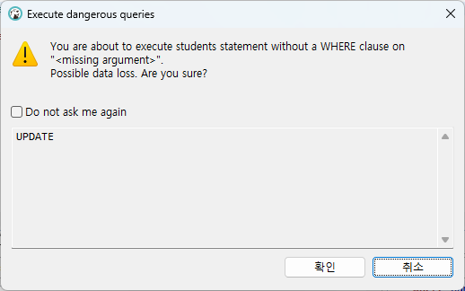

##### 데이터 삭제

- DELETE 쿼리로 삭제
- DELETE 쿼리 실행 시도 WHERE 절 없이 실행 주의 할 것!
- 삭제도 UPDATE와 동일한 경고메세지 창 표시됨

#### 테이블 삭제

- DELTE는 데이터 삭제, DROP은 테이블 자체 삭제

#### NULL

- NULL은 값이 없다는 뜻. 숫자 0 이나 빈 문자열('')와 다른 의미/ ' ' 과도 다름

#### 테이블 생성

- 테이블생성 쿼리

```sql
--테이블 생성
create table students(
id int generated always as identity primary key, --- 기본키(PK) - 중복안되고 NOT NULL
name varchar(50) not null, -- 이름은 NULL이 될 수 없다.
age int, -- 나이 NULL
email varchar(100), -- 이메일 NULL
major varchar(50), -- 전공 NULL
created_at timestamp defalut current_timestamp -- NULL이 들어갈 수 있음
);
```

- NULL 사용쿼리
- ```sql
  -- 데이터 추가
  insert into students (name, age, email, major)
  values('홍길동', 20, 'hong@example.com', '컴퓨터 공학');

  -- 전공을 null 집어넣음
  insert into students (name, age, email, major)
  values('성유고', 21, 'hugo@example.com', null);

  insert into students (name, age, email, major)
  values('성미나', null , 'mina@example.com', null);

  insert into students (name, email) -- 위와 동일한 결과
  values('성미나', 'mina@example.com');

  insert into students (name)
  values('최민식');

  insert into students (name, age, email, major)
  values(null, null , 'mina@example.com', null);

  insert into students (name, age, email)
  values('애슐리', 26 , 'mina@example.com');
  ```

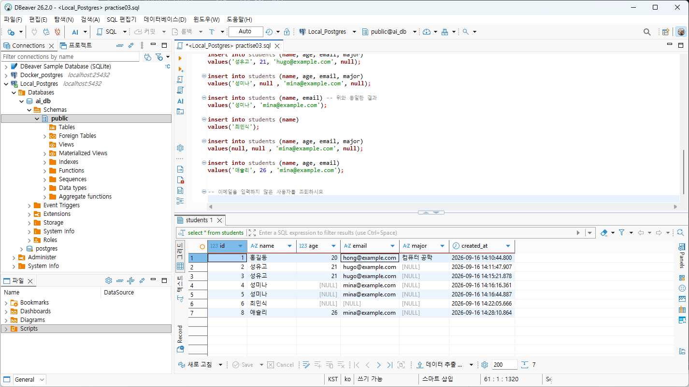

#### NULL 조회 쿼리

- `where 컬럼 is null 또는 is not null`

#### 테이블 설계

- 일반적으로 DB설계, 테이블 설계 통칭

##### 필요 개념

- 테이블 설계 - 논리적 테이블 설계, 물리적 테이블 설계
- 컬럼와 데이터 타입 선택
- 기본키 (PK) / 외래키 (FK)
- NOT NULL, UNIQUE, CHECK, 제약조건
- DEFAULT 제약조건
- 테이블 관계

학생과 과목 수강 관리 테이블 설계

### 테이블 설계란,

데이터를 어떤 테이블에 어떤 컬럼에 어떠한 관계를 가지고 저장할지 규정하는 작업

- 학생정보
  - 이름
  - 나이
  - 이메일
  - 전공
  - 수강과목
  - 담당 강사
  - 수강 신청일

*엑셀에서는 데이터를 제대로 관리하기 힘들다*

##### 좋은 테이블 설계

- 같은 데이터가 불필요하게 중복되지 않게 한다
- 한 테이블은 하나의 주제를 가진다
- 각 행(row)을 구분할 수 있는 기본키를 가진다
- 테이블 간의 관계가 외래키(FK)로 연결한다
- 잘못된 데이터가 들어가지 않도록 제약조건을 사용한다
- 조회, 수정이 이해하기 쉬운 구조여야 한다

#### 학생 테이블 컬럼 데이터타입 선택


| 구분                 | 설명                        | 데이터 타입               |
| -------------------- | --------------------------- | ------------------------- |
| 학생번호`id`         | 학생을 구분 , 반드시 필요   | `INT`, BIGINT, NUMERIC 중 |
| 학생이름`name`       | 문자열로 추가 , 반드시 입력 | `VACHAR(50)`, TEXT  중    |
| 이메일`email`        | 문자열, 선택으로 입력       | `VACHAR(200)`, TEXT       |
| 나이`age`            | 숫자, 150살 이하로만 제약   | `INT`...                  |
| 전공`major`          | 문자열                      | `VACHAR(50)`, TEXT        |
| 등록일자`created_at` | 학생정보를 입력한 일시      | DATE,`TIMESTEAMP` 중      |

- 정확한 숫자는 numeric, 긴 글은 text, 날짜만 필요하면 date, 참/거짓은 boolean

#### 제약 조건

##### 1. 기본키(PK)

> 테이블에서 각 행(row) 구분하는 대표값. Primay Key (PK) - **Unique에 Not Null**

- 중복 불가!
- 비어 있을 수 없다!
- 한 행을 대표
- 다른 테이블에서 참조한다

PostgreSQL은 `generated always as identity` 숫자 타입의 자동증가, `primary key`가 기본키를 지정한다

- 기본키 지정 문법

```sql
`id int generated always as identity primary key
```

MySQL에서 auto_increment, Oracle 에서 identity로 문법이 다름.

##### 2. 외래키(FK)

> 다른 테이블의 기본키를 참조하는 컬럼. Foreign Key(KF)

```plantext
Students(학생)
- id : 학생아이디 PK
- name : 학생이름

Enrollments(수강)
- id : 수강아이디 PK
- students_id : 학생아이디 FK
- course_name : 수강명
```
