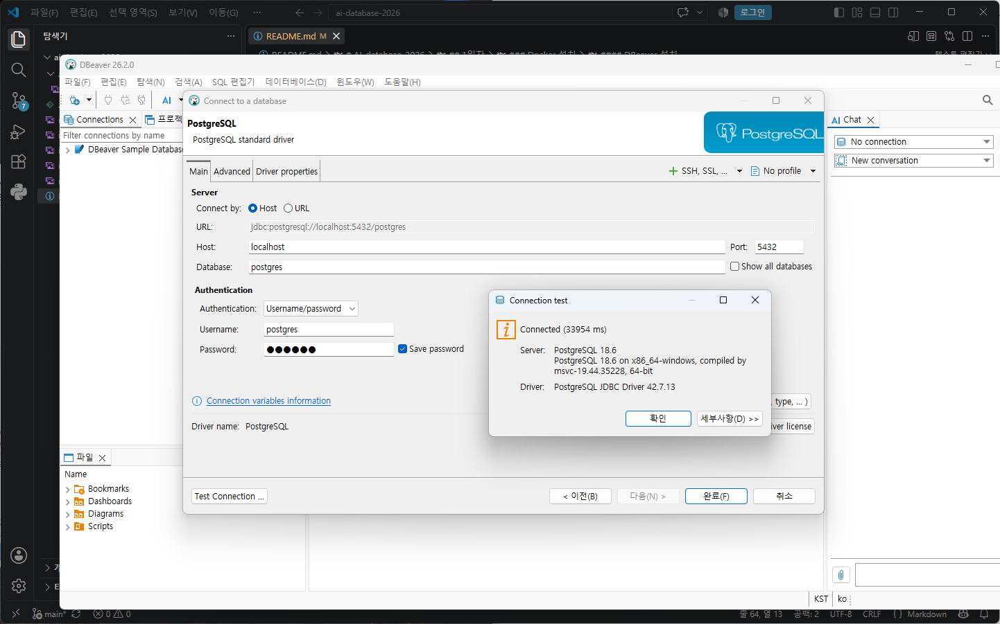
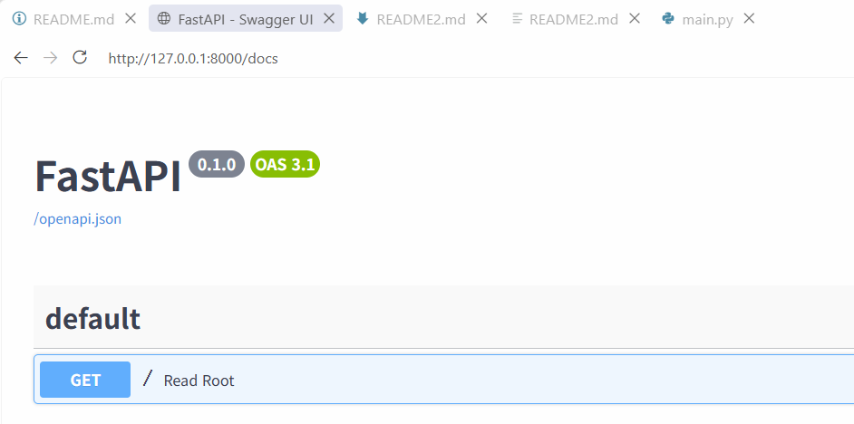
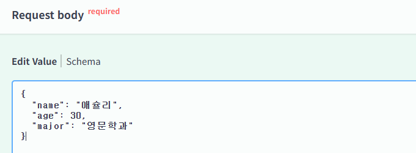
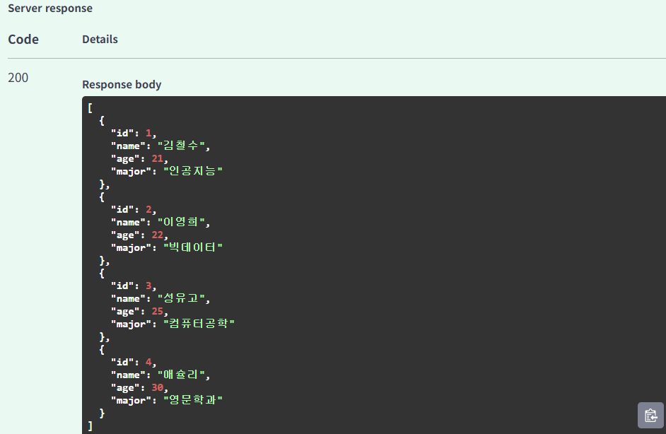

# FastAPI 데이터 연동

## 개요

- FastAPI - Python으로 API 서버를 만드는 웹 프레임워크
- API - Application Programming Interface
- 사용자(클라이언트)가 웹, 모바일, 앱에서 요청을 하면 FastAPI 서버가 요청을 처리, 결과를 돌려줌
- JSON 타입(파이썬 딕셔너리와 유사)으로 결과 리턴
- 예/

```plaintext
사용자(클라이언트)
-> GET /students 요청`
-> FastAPI 서버에서 DB를 조회
-> 학생목록 결과를 JSON 응답
```

- 클라이언트(요청 Request) -> 서버(응답 Response)

### FastAPI 특징

- Python 문법으로 API를 만들 수 있음
- 코드가 간결하다
- 실행 속도가 빠르다
- 테스트를 위한 UI를 자동으로 만들어 줌
- Pydantic을 사용, 요청과 응답 데이터를 검증 할 수 있다
- PostgreSQL, MySQL, Oracle 등 DB와 연동이 쉽다

### API서버란,

> 클라이언트 요청을 받아 필요한 작업을 수행. 그 결과를 클라이언트에게 돌려주는 프로그램

## 개발환경 설정

### FastAPI 패키지 설치

```bash
pip install fastapi uvicorn
```

- 현재 파이썬에 fastapi와 uvicorn 패키지를 설치
- fastapi 개발가능

```bash
pip list
```

- fastapi와 uvicorn 정상 설치완료되었는지 확인

### 기초 FastAPI 서버

- 소스
- VS Code 재실행

### 문제해결

- 설치한 uvicorn.exe 위치가 Python 설치 위치와 상이
- C:\Users\User\AppData\Roaming\Python\Python314\Scripts 경로가 시스템 경로에 등록 되어야함
- 시작 > 시스템 속성 (sysdm.cpl) 열기


- 환경변수 클릭 > 시스템변수 Path > 새로만들기 > 경로 넣어주기 > 확인
- VS Code, 터미널 재시작

### FastAPI 서버시작

```bash
uvicorn main:app --reload --port 8000
```

- `--reload` : 수정되면 곧바로 반영되어서 서버 재시작
- `--port` : 서버를 시작할 포트 지정
- http://127.0.0.1:8000 메세지 확인
  - 127.0.0.1 -> localhost


실행결과

### FastAPI 기본 학습

#### 웹 응답코드

- 200 : OK (정상 / 웹페이지에 문제없음)
- 404 : Page Not Fount 클라이언트가 요청한 페이지나 데이터가 없음
- 500 : Internal Server Error 내부 서버 오류

#### Swagger UI 확인

- FastAPI에서 자동으로 제공하는 API 테스트 페이지
- http(s)://adress:port/docs  (docs는 데이터 수정.삭제.조회해주는 Tool)



- api의 결과는 json타입 (문자열을 일반적으로 ""로 표현) 파이썬 딕셔너리는 ''로 표현한것과 차이

#### URL 경로

- `http(s)://address:port`
  - address : 127.0.0.1 또는 192.168.0.105 등 아이피주소 / www.naver.com,google.com 같은 도메인주소
  - port : 0 ~ 65535까지의 숫자
- `/` : root 기본되는 페이지
- `/students` : 추가 URL
- `/students/1` : 추가 URL. 경로파라미터
- `/?key=value&key=value` : URL 경로 GET쿼리(조회)파라미터 #옛날 URL 사용방식

#### HTTP(s) 메서드

FastAPI는 주소와 HTTP 메서드도 파악필요


| 메서드   | 의미            | 예시                        |
| -------- | --------------- | --------------------------- |
| `GET`*   | 데이터조회      | 학생목록조회, 특정학생 조회 |
| `POST`*  | 데이터생성      | 학생 등록 / 수정과 삭제     |
| `PATCH`  | 데이터일부수정  | 학생 전공 수정              |
| `PUT`    | 데이터 전체수정 | 학생 정보 전체 수정         |
| `DELETE` | 데이터 삭제     | 학생정보 삭제               |

- GET 메서드 외(POST,PATCH,PUT,DELETE)에는 swagger UI에서 테스트 해야 함(웹URL에서는 GET메서드만 가능)


#### 요청본문

- POST 나 PATCH 요청시 클라이언트가 JSON으로 데이터를 서버에 전달해야 함. 그 데이터를 등록 또는 수정.
- FastAPI에서는 Pydantic 형태로 사용
- JSON 데이터이므로 파이썬 None 대신 NULL로 사용
- } 닫기전 , 는 제거 (파이썬은 허용)

#### 메모리 기반(DB 사용X ) 학생 API 예제

- day05/memorydb.py
- GET method 함수 내용생략

#### POST 학생 정보 생성

- POST 메서드 작성
- Swagger 테스트

  - Try it out 클릭
  - Request body 입력 후 Excute 실행



- 실행결과



##### HTTPException

- API 상에 오류가 발생하면 오류(예외) 처리를 진행


| 상태코드  | 의미 |
| --------- | ---- |
| `200`,201 | 요청성공, 생성성공 |
| 403,`404` | 권한없음, 데이터없음 |
| `500`     | 서버 오류 |

### DB연동 FastAPI

- 실제 DB(PostgreSQL)을 연동해서 데이터를 가져와 사용하는 API 웹서버 구현
- 일반적인 API 서버 구조 

```plaintext
fastapi_postgres/(day06)
│
├── main.py          # FastAPI 실행 및 API
├── database.py      # PostgreSQL 연결
├── models.py        # 데이터 모델
│
└── requirements.txt # 필요한 패키지
```

- 더 간단한 구조로 작업

```plaintext
fastapi_postgres/(day06)
│
├── main.py          # FastAPI 웹 서버
└── database.py      # PostgreSQL 연결
```

한 파일로 만들 수 있지만 database,main,models 각각 파일을 만들어서 
관리하면 조회, 수정 등이 쉽다

### DB 연동 파이썬 패키지 설치
- psycopg 설치

```bash
pip install psycopg[binary]
```

- 내 개발환경(파이썬 패키지) 공유방법 
  requirments.txt 만들어서 파일전달

```bash
pip freeze > requirments.txt  # requirments 파일만들기
pip install -r requirments.txt # 전달받은 파일 개발환경 재설치명령어
```

#### 기존 PostgreSQL students 테이블 사용

##### database.py
- PostgreSQL 데이터베이스 연결용 소스코드
- 소스

##### main.py
- database.py를 호출해서 실제 DB연결과 FastAPI 작업 병행


### 디버깅

### 기본 파이썬 디버깅
 - Debug : 버그를 고치는 작업
 - 소스코드 작성에 60%, 디버그 40% 시간 소요
 - 디버그 단축키 
    - F5 : 디버그로 실행
    - F9 : 브레이크포인트 토글
    - F10 : 한단계씩 실행(함수 패스)
    - F11 : 한단계씩 실행(함수내 진입)


### FastAPI 디버깅
- 기존 FastAPI 코드 외 아래의 디버그 코드 추가

```python
import uvicorn

#기존코드 생략

if __name__ == '__main__':
  uvicorn.run(
       'main:app',
       host='127.0.0.1',
       port=8000,
       reload=True,
       log_level='debug'
  )
  ```

- `F5(디버그 모드)`로 실행
- 디버깅 필요한 함수나 로직에 `F9`로 종단점(Break Point)활성화
- `F10/F11`로 한줄씩 실행하면서 로직 처리 결과 모니터링,분석 > 조사식과 변수에서 데이터 확인
- 오류 로직 찾아서 수정 
- 다시 디버깅으로 정상동작 확인하고 완료


